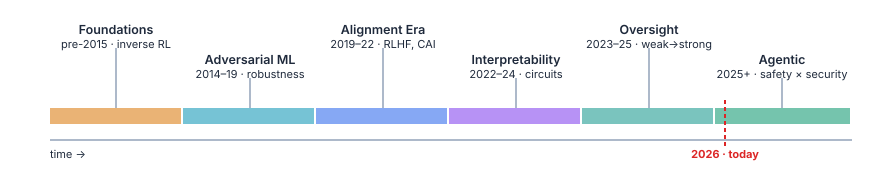

# AI Safety & Security

> *Foundations to the Agentic Frontier* — a living, continuously evolving reference for the
> **safety and security of agentic systems**.

Agentic systems are the bridge between AI safety and AI security: tool-use is the
security surface, autonomy is the safety problem. As systems are increasingly optimized
to be agentic, this intersection is where the most impactful problems now sit. This repo
is the canonical reference for that seam.



## Updates

- **2026-05-27** — Foundation of the book is now available: the *landscape* (core areas, timeline), the *safety × security two-track* taxonomy (attack surface, defensive architectures, formalization), and *agentic systems* (the bridge), plus a supplementary technical-notes part.

## Structure & pipeline

A book chapter is the distilled substrate; everything else flows from it.

| Path | Pipeline role |
|------|---------------|
| [book/](book/) | **The living book** (Quarto) — distilled core concepts, illustrations, formalizations. Organized by topic, chronological within each: Part I Foundations · Part II Topics · Part III Frontier · Part IV Supplement. |
| [research/](research/) | **arXiv review papers** built on chapters, each adding a novel contribution of its own. |
| *(blog)* | **Topic spin-offs** cross-posted to [surafelml.github.io](https://surafelml.github.io). |
| [projects/](projects/) | **Open-source R&D** — reusable tools and best-practice guides. |

## Setup & local run

Requires [Quarto](https://quarto.org) and [conda](https://docs.conda.io). The conda env is
named after the repo (`ai-safety-security`) and provides the Jupyter kernel for executable
code cells.

```bash
git clone https://github.com/surafelml/ai-safety-security.git
cd ai-safety-security

conda env create -f environment.yml   # creates env: ai-safety-security
conda activate ai-safety-security

quarto preview book/                  # live preview with auto-reload
quarto render book/                   # build to book/_site/
scripts/check.sh                      # render + integrity checks (citations, xrefs, code, css)
```

PDF output additionally needs a TeX install: `quarto install tinytex`.

## License

[MIT](LICENSE).
